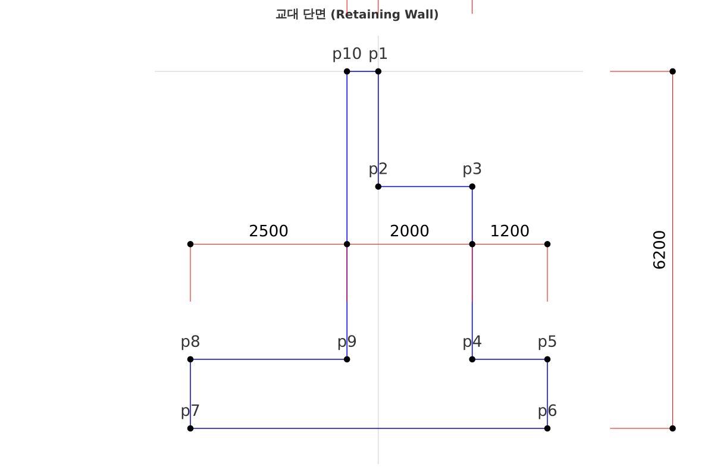
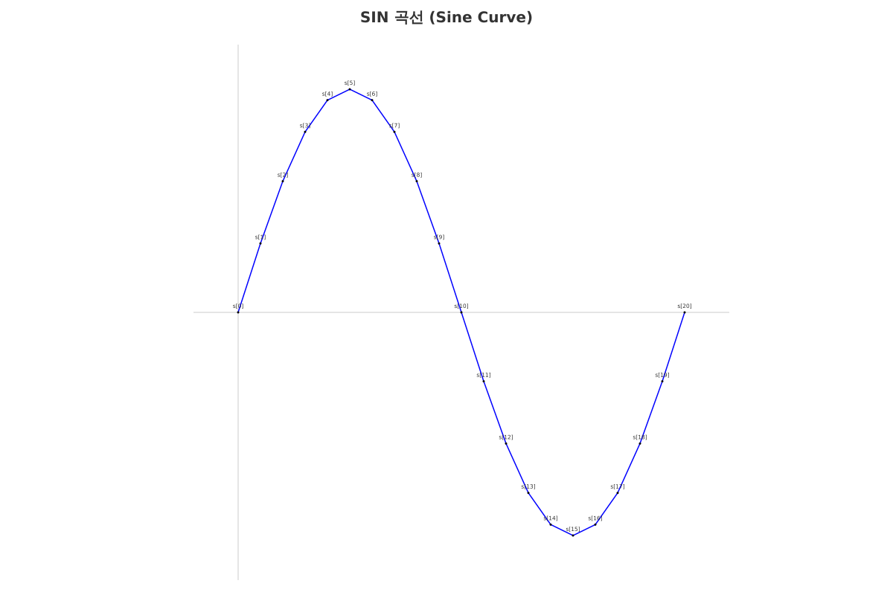
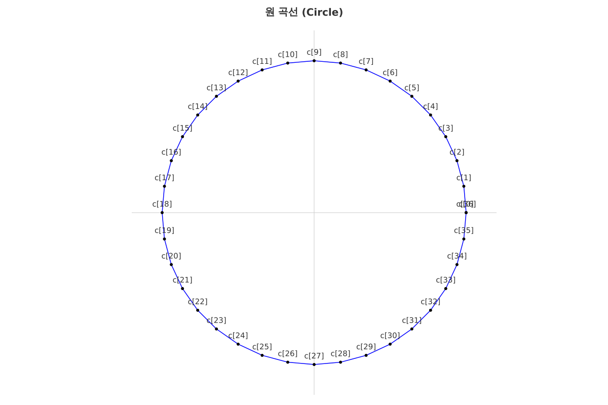
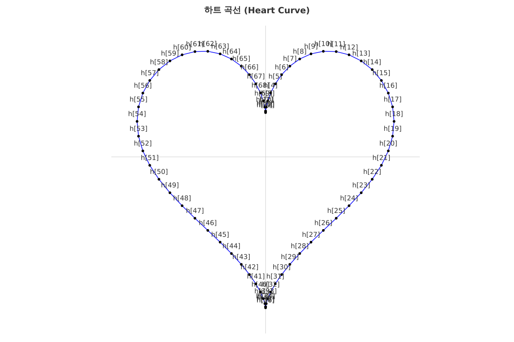

"# paradraw" 

이 웹앱의 목적은 사용자가 변수(parameter)를 이용해서 그림을 그릴 수 있도록 하는 것입니다. 

이번 업데이트 내역입니다.

1. 치수선을 넣을 수 있는 기능을 추가했습니다.
2. 예제 정보읽기를 추가했습니다.
3. 반복/순차 구문을 추가했습니다.
4. 입력을 하나의 통합 텍스트박스로 변경했습니다.
5. 예제 선택 기능을 추가했습니다 (교대 단면, SIN 곡선, 원 곡선, 하트 곡선).

### 통합 입력 형식

변수, 좌표, 선, 치수를 하나의 텍스트박스에 입력합니다. 줄 형식으로 자동 구분됩니다.

| 종류 | 형식 | 예시 |
|------|------|------|
| 변수 | `이름=값` | `H1=2000;높이` |
| 좌표 | `이름=x수식,y수식` | `p1=0,0` |
| 선 | `line,점1,점2,...` | `line,p1,p2,p3;외벽` |
| 수평치수 | `HDIM,방향,점1,점2,...` | `HDIM,1,p1,p2;폭` |
| 수직치수 | `VDIM,방향,점1,점2,...` | `VDIM,-1,p1,p2` |
| 경사치수 | `ADIM,방향,점1,점2` | `ADIM,1,p1,p2` |

- `;` 뒤에 주석을 추가할 수 있습니다
- 방향: `1`(정방향), `-1`(역방향)

### 예제

드롭다운에서 예제를 선택하고 "예제 로드" 버튼을 클릭하면 예제 데이터가 로드됩니다.

#### 1. 교대 단면

변수로 치수를 제어하는 옹벽 단면도입니다. 치수선(HDIM, VDIM)으로 각 부위의 크기를 표시합니다.

```
H1=2000;흉벽높이
H2=3000;벽체높이
H3=1200;기초두께
B1=2500;뒷굽폭
B2=2000;벽체두께
B3=1200;앞굽폭
B4=500;흉벽두께
p1=0,0
p2=p1.x,p1.y-H1
p3=p2.x+B2-B4,p2.y
p4=p3.x,p3.y-H2
p5=p4.x+B3,p4.y
p6=p5.x,p5.y-H3
p7=p6.x-B3-B2-B1,p6.y
p8=p7.x,p7.y+H3
p9=p8.x+B1,p8.y
p10=p9.x,p1.y
line,p1..p10,p1;외벽
HDIM,-1,p7,p6;전체폭
HDIM,1,p8,p9,p4,p5;상부폭
HDIM,1,p10,p1,p3;흉벽폭
VDIM,1,p6,p1;전체높이
```



#### 2. SIN 곡선

반복 구문 `s[0-N]`을 사용하여 사인 곡선을 그립니다.

```
A=500;진폭
L=2000;길이
N=20;분할수
s[0-N]=L/N*i,A*Math.sin(2*Math.PI*i/N);sin곡선
line,s[0]..s[N]
```



#### 3. 원 곡선

`Math.cos`, `Math.sin`으로 원을 그립니다.

```
R=500;반지름
N=36;분할수
c[0-N]=R*Math.cos(2*Math.PI*i/N),R*Math.sin(2*Math.PI*i/N);원
line,c[0]..c[N],c[0]
```



#### 4. 하트 곡선

`Math.pow`와 삼각함수를 조합한 매개변수 하트 방정식입니다.

```
S=30;크기
N=72;분할수
h[0-N]=S*16*Math.pow(Math.sin(2*Math.PI*i/N),3),S*(13*Math.cos(2*Math.PI*i/N)-5*Math.cos(4*Math.PI*i/N)-2*Math.cos(6*Math.PI*i/N)-Math.cos(8*Math.PI*i/N));하트
line,h[0]..h[N],h[0]
```



### 반복/순차 구문

다수의 점을 한 줄로 생성하고, 선/치수선에서도 간편하게 연결할 수 있습니다.

**좌표 입력 — 범위 반복 `name[start-end]`**

`i`를 인덱스 변수로 사용하여 수식을 반복 평가합니다. 범위 경계에 변수도 사용 가능합니다.

```
s[0-N]=L/N*i,A*Math.sin(2*Math.PI*i/N)
```
위 입력은 아래와 같이 확장됩니다 (N=20일 때):
```
s[0]=L/N*0,A*Math.sin(2*Math.PI*0/N)
s[1]=L/N*1,A*Math.sin(2*Math.PI*1/N)
...
s[20]=L/N*20,A*Math.sin(2*Math.PI*20/N)
```

**선/치수선 입력 — 범위 확장 `name[start-end]`**

포인트 범위를 개별 포인트 목록으로 확장합니다.

```
line,s[0-N]      → line,s[0],s[1],...,s[20]
HDIM,1,s[0-5]    → HDIM,1,s[0],s[1],s[2],s[3],s[4],s[5]
```

**선/치수선 입력 — 순차 확장 `..`**

시작점과 끝점 사이의 중간 점을 자동 생성합니다. 숫자 접미사와 브라켓 표기 모두 지원합니다.

```
line,p1..p10     → line,p1,p2,p3,...,p10
line,s[1]..s[20] → line,s[1],s[2],...,s[20]
```

콤마 리스트와 혼합 사용도 가능합니다: `line,p1,p3..p7,p10`

**포인트 참조**

생성된 포인트는 다른 좌표 수식에서 참조할 수 있습니다.
```
t1=s[10].x,s[10].y+100
```

**사용 예시 (sin 곡선)**

```
A=500;진폭
L=2000;길이
N=20;분할수
s[0-N]=L/N*i,A*Math.sin(2*Math.PI*i/N)
line,s[0]..s[N]
```

실행방법은 paradraw1.html파일을 다운로드 받은 다음 파일탐색기에서 열면 됩니다. html파일 안에 javascript코드가 포함되어 있습니다.

앞으로의 계획 
1. 게시판에 그림정보(json)를 공유할 수 있도록 하면 간단한 단면도나 삽도는 공유할 수 있지 않을까 합니다.
2. 단면계수 구하기 등 도형을 기준으로 할 수 있는 다른 기능을 추가해보려고 합니다.

사용해보시고 조언부탁드립니다. 


